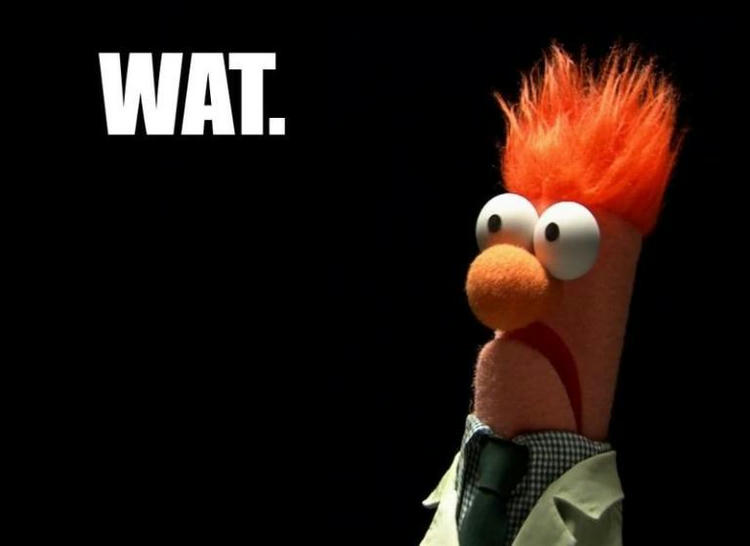

## Chapter 2

### Categories of Data Models

An **entity** represents a real-world object or concept, such as an employee  or a project from the mini world that is described in the database. 

An **attribute** represents some property of interest that further describes an entity, such as the employee's name or salary.

A **relationship** among two or more entities represents an association among the entities, for example, a works-on relationship between an employee and a project.

### Schemas, Instances, and Database State

In a data model, it is important to distinguish between the description of the database and the database in itself. The description of the database is called the **database schema**.
The actual data in a database may change quite frequently. The data in the database at a particular moment in time is called **database state** or **snapshot**.

### Three-Schema Architecture and Data Independence

#### The Three-Schema Architecture

The goal of the three-schema architecture, illustrated in Figure 2.2, is the separate the user applications from the physical database. In this architecture, skimmer can be defined at the following three levels:
1. The internal level has an internal schema, which describes the physical storage structure of the database.
2. The conceptual level has a conceptual schema, which describes the structure of the whole database for a community of users.
3. The external or view level includes a number of external schemas or user views.

### Data Independence

We can define two types of data independence:
1. Logical data independence is the capacity to change the conceptual schema without having to change external scheme mask or application programs.
2. Physical data independence is the capacity to change the internal schema without having to change the conceptual schema.

### Database Languages and Interfaces

#### DBMS Languages
- data definition language
- storage definition language (SDL)
- view definition language
- data manipulation language
- high-level or procedural language

### Centralised and Client/Server Architectures fro DBMSs

#### Two-Tier Client/Server Architectures fro DBMSs

In relational database management systems (RDBMSs), many of which started as centralised systems, the system compliments that were first moved to the client side where the user interface and application programs. Because SQL provided a standard language for RDBMSs, this created a logical dividing point between clients and server. Hence, the query and transaction functionality related to SQL processing remained on the server site. You're such an architecture, the server is often called query server or transaction server because it provides these two functionalities. In an RDBMS, the server is also often called an **SQL server**.

### Summary

We find a data model and with distinguish three main categories\>
- high-level or conceptual data models (based on entities and relationships)
- low level or physical data models
- representational or implementation data models (record-based, object-oriented)

We distinguished the schema, or description of a database, from the database itself. The schema does not change very often, whereas the database state changes every time data is inserted, deleted, or modified. Then we described the three-schema DBMS architecture, which allows three schema levels:
- An internal schema describes the physical storage structure of the database.
- A conceptual schema is a high-level description of the whole database.
- External schemas describe the views of different user groups.

Wat !

<!DOCTYPE html>
<html lang="en">
<head>
    <meta charset="UTF-8">
    <meta name="viewport" content="width=device-width, initial-scale=1.0">
    <title>Image Test</title>
</head>
<body>

    <h1>Test Image</h1>

    

</body>
</html>
